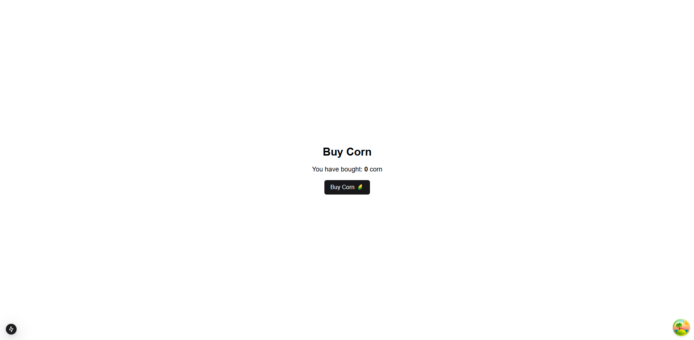
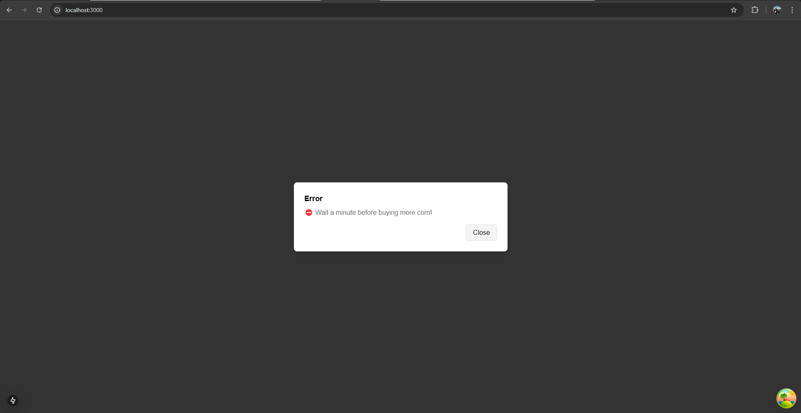

# Bob's Corn 🌽
# A PERN stack application with rate limiting and a client portal.

Overview
Bob’s Corn is a full-stack application built using the PERN stack (PostgreSQL, Express/NestJS, React, Node.js). It includes:

A rate limiter in the backend to restrict purchases to 1 corn per client per minute.
A frontend where clients can interactively purchase corn and track their progress.
Project Structure
The project is organized as a monorepo:

# Frontend built with Next.js and React Query
- **[Frontend README](https://github.com/lautarosoliani/bobs-corn/tree/main/frontend)**  
  Contains instructions to set up and run the frontend.

# Backend built with NestJS and Prisma
- **[Backend README](https://github.com/lautarosoliani/bobs-corn/tree/main/backend)**  
  Contains instructions to set up and run the backend.
  
# Application Behavior - Frontend
Clicking the "Buy Corn" button triggers a purchase request to the backend.
Successful purchase (200 OK):
The frontend updates the purchase count dynamically.
Rate limit exceeded (429 Too Many Requests):
An alert is displayed: "⛔ Wait a minute before buying more corn!"
Other errors:
An alert is displayed: "💥 Server error, please try again later."

# Application Behavior - Backend
The /purchase endpoint implements rate limiting
If a purchase is made within the last minute returns 429 Too Many Requests.
If no recent purchase exists logs the new purchase and returns 200 OK.
How It Works
First Purchase:
The backend registers the purchase and responds with 200 OK.
The frontend increments the purchase count and displays the updated total.
Subsequent Purchases Within a Minute:
The backend enforces the rate limit and responds with 429 Too Many Requests.
The frontend displays an alert to wait before buying more corn.
After the Rate Limit Expires:
The backend allows a new purchase, responds with 200 OK, and the cycle repeats.

  
# Requirements
Before running the application, ensure you have the following installed:

Node.js (v18 or higher)
Yarn (optional, you can use npm)
PostgreSQL
Install PostgreSQL and set up a database on localhost:5432.
Configure credentials in the .env file 

# Environment Variables
Create a .env file in the backend directory with the following content:
DATABASE_URL="postgresql://<username>:<password>@localhost:5432/bobs_corn_db"
Replace <username> and <password> with your PostgreSQL credentials.

How to Run the Project
1. Backend
Navigate to the backend directory and follow these steps:

# Install dependencies
cd backend
yarn install # or npm install

# Run database migrations
npx prisma migrate dev --name init

# Start the backend server
yarn run start:dev # or npm run start:dev
The backend will be available at http://localhost:3001.

2. Frontend
Navigate to the frontend directory and follow these steps:

# Install dependencies
cd frontend
yarn install # or npm install

# Start the development server
yarn dev # or npm run dev
The frontend will be available at http://localhost:3000.
